# Project Requirements Document (PRD): SpendSight

## 1. Project Overview
SpendSight is a locally hosted, privacy-first personal finance application designed to ingest bank and credit card statements, categorize transactions at the vendor level, and visualize spending habits. The system emphasizes data privacy by operating completely offline and permanently deleting source statement files immediately after ingestion.

## 2. Core Requirements & Scope
* **Strictly Local Execution:** The entire stack must run locally. External APIs for data processing are strictly prohibited to ensure maximum data privacy.
* **Multi-Format Statement Ingestion:** The system must accept both CSV files and natively parse tabular data from PDF statements.
* **Ephemeral Source Data:** Source statement files must be permanently deleted immediately upon successful parsing and database commit.
* **Vendor Normalization:** Raw, messy transaction strings must be accurately normalized into clean vendor entities and categorized using a local LLM.
* **CLI-First Operation:** The application backend, orchestrator, and processing tasks will be executed directly via the Command Line Interface (CLI). Graphical IDEs (like Jupyter Notebooks) are explicitly excluded from the development and execution workflow.
* **Persistent Storage:** A lightweight, local relational database acting as the single source of truth.

## 3. Architecture & Tech Stack

```mermaid
sequenceDiagram
    participant U as User
    participant Dir as /ingest Directory
    participant Go as Go Orchestrator
    participant Py as Python Pipeline
    participant LLM as Ollama (gemma4:e2b)
    participant DB as SQLite

    U->>Dir: Drops Statement (PDF/CSV)
    Go->>Dir: Watches for new files
    Dir-->>Go: File Detected
    Go->>Py: Trigger Extraction (CLI Exec)
    
    rect rgb(40, 44, 52)
        Note over Py,LLM: Python Processing Layer
        Py->>Py: Extract Tables (pdfplumber/csv)
        Py->>Py: Wrangle & Type Cast (polars)
        Py->>LLM: Raw Vendor String via Instructor/DSPy
        LLM-->>Py: Normalized Pydantic JSON
    end
    
    Py-->>Go: Return Structured Payload
    Go->>DB: Insert & Verify Records
    Go->>Dir: Securely Delete Original File
    
    U->>DB: Query via Terminal UI (Textual)
```

### 3.1 Backend Orchestration & API (Golang)
* **Role:** Directory monitoring, task orchestration, database connection management, and file lifecycle management.
* **Key Tasks:** * Watch the `/ingest` directory for incoming files.
  * Trigger the Python extraction and processing pipeline via shell execution.
  * Receive structured JSON payloads and insert them into the database.
  * Execute secure deletion of the original statement files.

### 3.2 Data Extraction & Processing (Python)
* **Role:** Ingesting raw files, extracting data, and performing heavy data wrangling.
* **Libraries:**
  * `pdfplumber` & `csv`: For offline extraction of raw structured tables.
  * `polars`: For performant, memory-efficient data wrangling and schema standardization.
* **Local LLM Extraction Layer:**
  * **Inference Server (`Ollama`):** A background CLI process hosting local small language models (e.g., Gemma 4, Phi-4) and exposing a local API. Optimized for Apple Silicon.
  * **Structuring Framework (`Instructor` or `DSPy`):** Acts as the client within the Python script. Routes the raw transaction strings to the local inference server and enforces strict Pydantic JSON schemas for vendor and category extraction, eliminating the need for fragile regex parsing.

### 3.3 Storage Layer
* **Technology:** `SQLite`.

### 3.4 Frontend / Visualization (Python)
* **Role:** Visualizing spending analytics at the vendor and category level.
* **Technology:** CLI-native terminal UI (`Textual`).

## 4. Documentation & Memory Management
To maintain absolute rigor and context across development sessions, the project will strictly maintain the following root-level files:
* **`PRD.md`:** This living document defining scope, architecture, and core requirements.
* **`SPEC.md`:** The definitive technical specification file. It will contain exact data schemas, API contracts, table definitions, and input/output structures for every module. This must be updated before any code changes.
* **`CONSTITUTION.md`:** The governing ruleset for the codebase and AI collaboration. It defines coding style, testing mandates (TDD), CLI-only constraints, and the strict division of labor between Python and Go.
* **`TODO.md`:** Task tracking, structured specifically to align with the chosen development methodology.

## 5. Development Methodology
* **Spec-Driven Development (SDD):** System specifications and schemas must be explicitly defined and locked in `SPEC.md` before pipeline construction begins.
* **Test-Driven Development (TDD):** Tests strictly dictate implementation. For every task in the `TODO.md`, xUnit-style tests must be written and executed prior to writing the core implementation logic.
* **CLI-Exclusive Development:** All scripts, tests, and database migrations will be built to be run natively from the terminal. 

## 6. Data Flow
1. Statement file is dropped into the `/ingest` directory.
2. Golang watcher detects the file and triggers the Python pipeline.
3. Python extracts raw tabular data (`pdfplumber` or `csv`).
4. 4. Data is loaded into a polars DataFrame, and the specific bank's YAML profile is applied to enforce the Canonical Sign Standard.
5. `Instructor`/`DSPy` queries the local `Ollama` server to normalize vendor names and map categories into structured Pydantic models.
6. Cleaned data is outputted as a structured JSON payload.
7. Golang verifies data integrity and commits records to SQLite.
8. Golang securely deletes the original statement file.
9. User executes the `Textual` dashboard via CLI to query SQLite and view analytics.