# SpendSight 👁️💰

**A Privacy-First, Local LLM-Powered Personal Finance CLI**

SpendSight is a fully local, command-line application that ingests bank and credit card statements, intelligently normalizes vendor names using local Small Language Models (SLMs), and visualizes your spending habits through a rich interactive terminal dashboard. 

Built with an absolute commitment to data privacy, SpendSight operates completely offline. Your financial data never leaves your machine, and source statement files are securely and permanently deleted the moment they are successfully committed to the local database.

---

## 🏗️ System Architecture & Data Flow

SpendSight utilizes a strict separation of concerns, employing a "dumb pipe, smart endpoints" philosophy. Go acts as the secure, high-speed system orchestrator, while Python handles the heavy data wrangling and LLM inference.

```mermaid
sequenceDiagram
    participant U as User
    participant Dir as /ingest Directory
    participant Go as Go Orchestrator
    participant Py as Python Pipeline
    participant LLM as Ollama (gemma4:e2b)
    participant DB as SQLite

    U->>Dir: Drops Statement (PDF/CSV)
    Go->>Dir: Watches for new files
    Dir-->>Go: File Detected
    Go->>Py: Trigger Extraction (CLI Exec)
    
    rect rgb(40, 44, 52)
        Note over Py,LLM: Python Processing Layer
        Py->>Py: Extract Tables (pdfplumber/csv)
        Py->>Py: Wrangle & Type Cast (polars)
        Py->>LLM: Raw Vendor String via Instructor/DSPy
        LLM-->>Py: Normalized Pydantic JSON
    end
    
    Py-->>Go: Return Structured Payload
    Go->>DB: Insert & Verify Records
    Go->>Dir: Securely Delete Original File
    
    U->>DB: Query via Terminal UI (Textual)
```

## 🗺️ The Development Journey (Methodology)
This project was built with unwavering adherence to rigorous software engineering principles:

Spec-Driven Development (SDD): No code was written until schemas, API boundaries, and database layouts were explicitly locked into a SPEC.md document.

Test-Driven Development (TDD): Every single module across both Go and Python was implemented by first writing failing unit/integration tests (pytest and go test), followed by defensive implementation code to turn them green.

CLI-First Context: Graphical IDEs were entirely eschewed. The entire pipeline, testing suite, and application interface natively live in the terminal.

## Phase Completion Log
✅ Phase 1: Environment Setup & Go Backend Orchestration (TDD)

✅ Phase 2: Python Extraction Pipeline & Config Management (TDD)

✅ Phase 3: LLM Transformation & Entity Normalization (SDD/TDD)

✅ Phase 4: Analytics Dashboard Data Contracts & Textual UI Construction (SDD/TDD)

✅ Phase 5: Final Integration & Go CLI Router Routing

--- 

Built with precision, paranoia, and Polars.